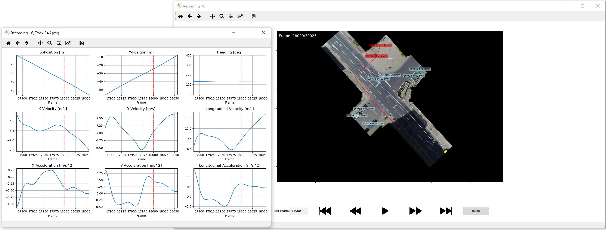

# Drone-Dataset Tools


The goal of this repository is to make using [drone datasets](https://www.drone-dataset.com/) as easy as possible. 
Therefore, we provide source code in Python for import and visualization. 
Thus, this source code not only allows to visualize trajectories and thus get an overview, but also serves as a template for your own projects.

## Extractor documentation:
Read the documentation [here](./doc/extractors.md) for the extractor API.
Read the documentation [here](./doc/visualization.md) for the visualization API..

## Installation and Quick Start

1. Create a new Python environment or select a pre-existing one. 
   This code is tested with Python 3.8, but is very probably compatible with newer releases of Python.

   If you use Anaconda3, this can be done as follows:
   ```shell 
   conda create --name drone-dataset-tools38 python=3.8
   conda activate drone-dataset-tools38
   ```

2. Install required packages by navigating to the root directory and using
    ```shell 
    pip3 install -r requirements.txt
    ```
3. To run the visualization tool, first, navigate to the `src/` directory
   ```shell
   cd src
   ```
4. Then to visualize e.g. *recording 26* from the *exiD dataset*, either copy the content of the dataset's `data/` directory into the `data/` subdirectory of this repository and use
   ```shell
   python3 run_track_visualization.py --dataset exid --recording 26
   ```
   or you can skip the data copying and directly provide the path to the dataset's `data/` directory by using the `--dataset_dir` command line option:
   ```shell
   python3 run_track_visualization.py --dataset_dir /<path/to>/exiD-dataset-v2.0/data/ --dataset exid --recording 26
   ```
   See below for further explanations.

## Importer
### tracks_import.py
This module allows to import the tracks, tracks meta info and recording meta info for a single recording 
(`read_from_csv(tracks_file, tracks_meta_file, recordings_meta_file)`)
or for all recordings (`read_all_recordings_from_csv(base_path)`).


## Visualizer
The visualizer imports the data and visualizes them on an image of the recording site.
The user may visualize specific frames or just playback the recorded tracks. In addition, information like the track id or speeds may be displayed (see "Command-line Options").

Each road user class has its own color: cars are light blue, vans are purple, buses are orange, trucks are orange, pedestrians are red, 
bicycles are yellow and motorcycles are yellow.



By clicking on track, a separate window is created with plots of the clicked track's positions, headings, velocities and accelerations.
* If additional columns (i.a. `leadDHW`, `leadTTC`, ...) are present in the `*_tracks.csv`, these are shown in the pop-up window instead.
* If *surrounding vehicle ID* columns (i.e. `leadId`, `rearId`, ...) are present in the `*_tracks.csv`, the corresponding vehicles are colored in the visualization. These are also updated during playback.<br />
(Hint: Use the `--suppress_track_window` argument to quickly check the surrounding vehicles of several tracks without opening a lot of track windows)

The following shortcuts are currently implemented:

| Keyboard Shortcut | Description |
| ---           | --- |
| space         | Play/Stop the playback |
| right arrow   | Jump to next frame |
| left arrow    | Jump to previous frame |

### Command-line Options
The command-line options can be used when starting the `run_track_visualization.py` script. 
For example, run the following command from 
the `src` directory to start the visualization of recording 26, when the dataset is present in the `data/` folder.
```shell
python3 run_track_visualization.py --dataset exid --recording 26 
```

All available options are listed in the following table:

| Command-line Options      | Default value   | Description |
| ---                       | ---             | --- |
| `--help`                    | -               | Show this help message. |
| `--dataset_dir`             | `"../data/"`      | Path to directory that contains the dataset csv files. |
| `--dataset`                 | `exid` | Name of the dataset (ind, round, exid, unid). Needed to apply dataset specific visualization adjustments. |
| `--recording`               | `26`            | Name of the recording given by a number with a leading zero. | 
| `--playback_speed`          | `4`               | During playback, only consider every nth frame. | 
| `--suppress_track_window`   | `False`           | Do not show the track window when clicking on a track. Only surrounding vehicle colors are displayed. | 
| `--show_bounding_box`       | `False`           | Plot the rotated bounding boxes of all vehicles.  Please note, that for vulnerable road users, no bounding box is given. |  
| `--show_orientation`        | `False`           | Indicate the orientation of all vehicles by triangles. | 
| `--show_trajectory`         | `False`           | Show the trajectory up to the current frame for every track. | 
| `--show_future_trajectory`  | `False`           | Show the remaining trajectory for every track. | 
| `--annotate_track_id`       | `False`           | Annotate every track by its id. | 
| `--annotate_class`          | `False`           | Annotate every track by its class label. | 
| `--annotate_speed`          | `False`           | Annotate every track by its current speed. | 
| `--annotate_orientation`    | `False`           | Annotate every track by its current orientation. | 
| `--annotate_age`            | `False`           | Annotate every track by its current age. | 
| `--show_maximized`          | `False`           | Show the track Visualizer maximized. Might affect performance. | 
| `--ped_only`                | `False`           | Only render frames with pedestrians and a button to jump to the next pedestrian's initial frame. | 

*Please note that drawing additional features may decrease the playback animation update rate.*

## Citation

If you use one of our datasets or these scripts in your work, please cite our datasets as follows:
### inD Paper
```
@INPROCEEDINGS{inDdataset,
               title={The inD Dataset: A Drone Dataset of Naturalistic Road User Trajectories at German Intersections},
               author={Bock, Julian and Krajewski, Robert and Moers, Tobias and Runde, Steffen and Vater, Lennart and Eckstein, Lutz},
               booktitle={2020 IEEE Intelligent Vehicles Symposium (IV)},
               pages={1929-1934},
               year={2019},
               doi={10.1109/IV47402.2020.9304839}}
```
### rounD Paper
```           
@INPROCEEDINGS{rounDdataset,
               title={The rounD Dataset: A Drone Dataset of Road User Trajectories at Roundabouts in Germany},
               author={Krajewski, Robert and Moers, Tobias and Bock, Julian and Vater, Lennart and Eckstein, Lutz},
               booktitle={2020 IEEE 23rd International Conference on Intelligent Transportation Systems (ITSC)},
               year={2020},
               doi={10.1109/ITSC45102.2020.9294728}}
```

### exiD Paper
```
@inproceedings{exiDdataset,
               title={The exiD Dataset: A Real-World Trajectory Dataset of Highly Interactive Highway Scenarios in Germany},
               author={Moers, Tobias and Vater, Lennart and Krajewski, Robert and Bock, Julian and Zlocki, Adrian and Eckstein, Lutz},
               booktitle={2022 IEEE Intelligent Vehicles Symposium (IV)},
               pages={958-964},
               year={2022},
               doi={10.1109/IV51971.2022.9827305}}
```
