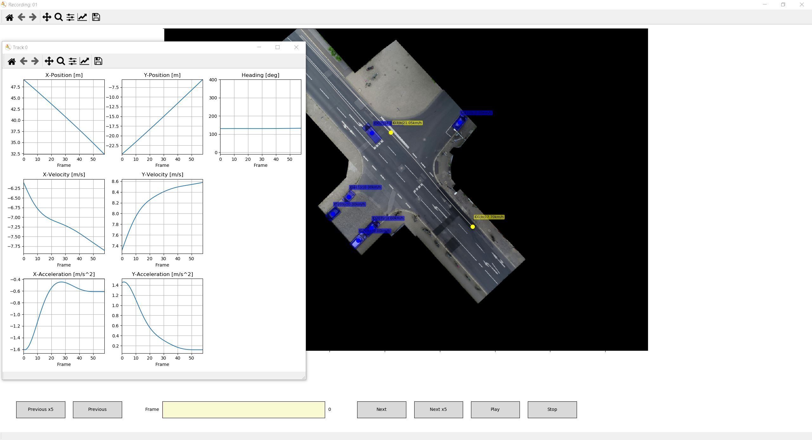

# inD Dataset Python Tools

  

The goal of this repo is to make the [inD dataset](https://www.ind-dataset.com/) as easy to use as possible. For this purpose we provide source code 
in Python, which allows the import and visualization of the dataset. 

## TL;DR
1. Install required packages e.g. by `pip3 install -r requirements.txt`.
2. Copy the csv files of the inD dataset into the data subdirectory.
3. Run `python3 run_track_visualization.py --recording_name 01` from the `src` directory.

## Installation
This Track Visualizer is tested with Python 3.6 but is very probably compatible with newer or slightly older releases.
See `requirements.txt` for the python modules that are used. You can use `pip3 install -r requirements.txt` to install 
the requirements directly with pip. 

## Module Description
### `tracks_import.py`
This module allows to import either the tracks, static track info and recording meta info for a single recording or for 
all recordings by calling `read_from_csv(track_file, static_tracks_file, recordings_meta_file)` 
and `read_all_recordings_from_csv(base_path)`.

### `run_track_visualization.py`
This module uses the `track_visualizer` to create a gui to playback the provided recordings. Besides a visualization of 
the tracks, a click on a displayed text box of an track creates plots of the most important information. The script has 
many different parameters, which are listed and explained in the `run_track_visualization.py` file itself. The most 
important parameter is the `recording_name`, which specifies the recording to be loaded. 

