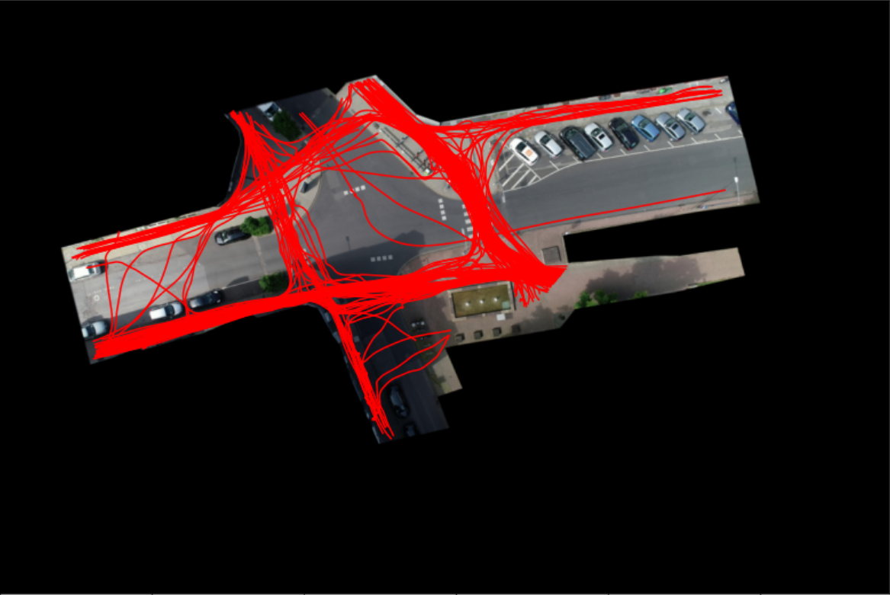
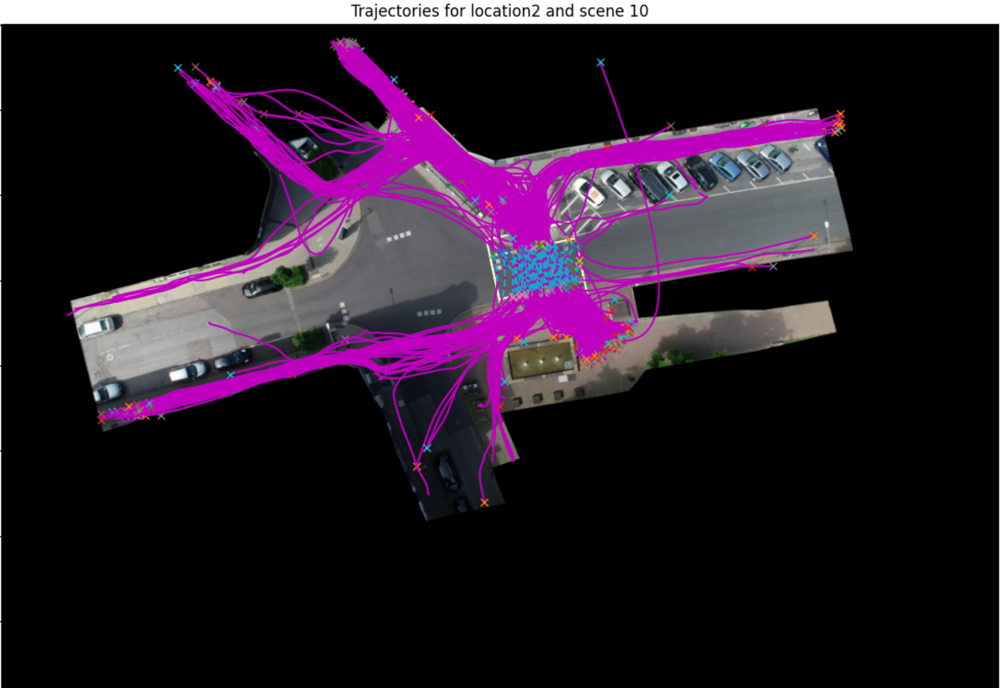
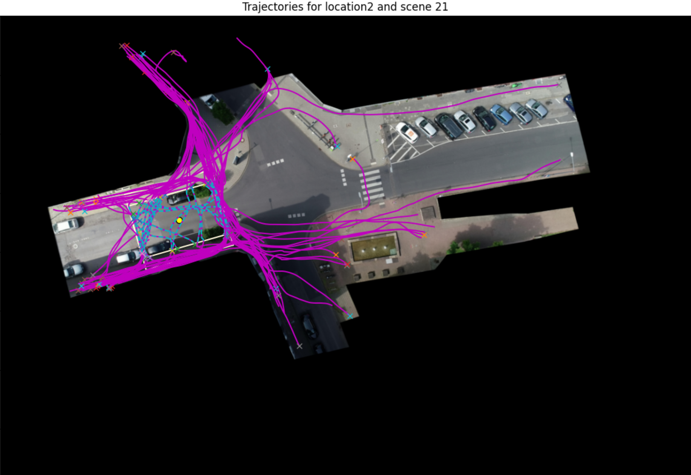
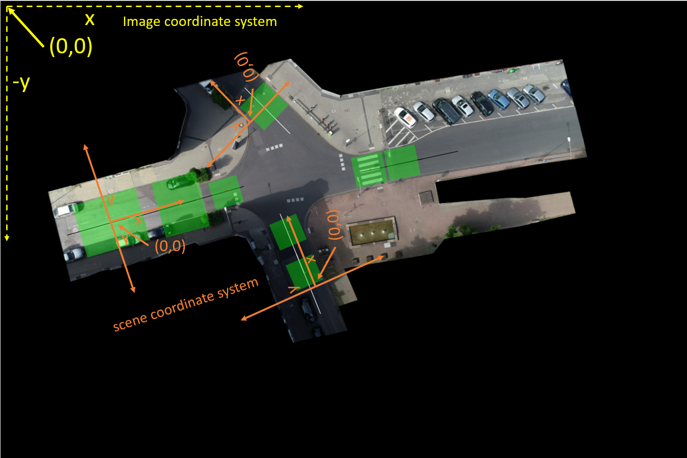
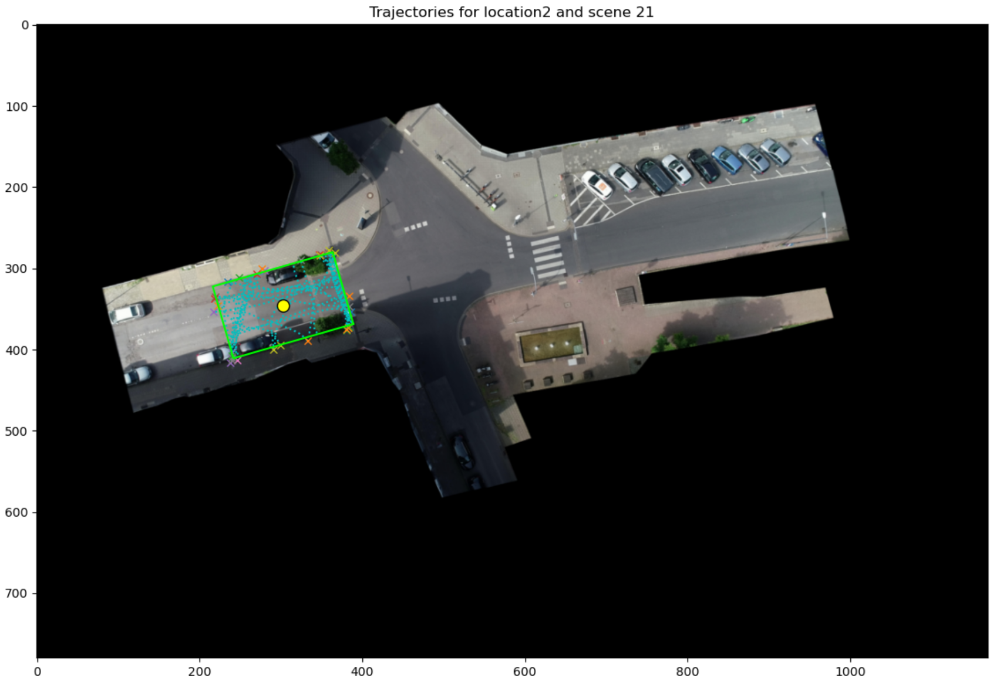
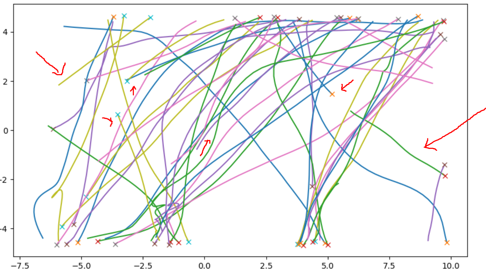

# Pedestrian trajectory extraction and processing

This tool provides extraction and processing scripts for jaywalker trajectories. It currently extracts data from InD dataset. But the approach can be used for any BEV dataset.

## Architecture & Tutorials
1. [Methodology for Extraction](extractors-methodology.md) 
2. [Quick start](how-to-use.md)
3. [Extractors](extractors.md)
4. [Visualization tools](visualization.md)
5. [Threads to validity](threats-to-validity.md)

## Goal

The raw dataset has pedestrian and vehicle trajectories. The following figure shows the pedestrian trajectories. The goal of this project is to extract pedestrians that cross the road and clip their trajectories to the interesting zone only. 

In the following figures, the purple ones are complete trajectories and the blue ones are clipped to the crossing area of the road.

## Scene coordinate system:

The original data has position and dynamics in the image coordinate system which is the top-left pixel of the background image. Our extracted data transforms trajectories into scene coordinate system where the origin is at the center of the scene bounding box and x axis is rotated counter-clockwise to aligh with the road reference line (length).

So, our scene data looks like this (plotted in the image coordinate system)

## Issues with the data
The dataset is annotated by a model trained with a deep learning object tracking method. So, it sometimes fail to classify and track objects correctly. Our exploratory analysis discovered some issues with the dataset:

1. Unrealistic paths - there are long pedestrian trajectories that run along the road (over 50 meters). There is a high probability that bicyles or scooters are classified as pedestrians.
2. Unrealistic speed - Some pedestrians seems to be too fast. Interestingly, then can run as fast as 30 km/h which professional atheletes or sprintters can achieve on track or in the field. We re-labeled them as fast_pedestrian as they interact with other traffic participants.
3. Incomplete trajectories - Pedestrians can pop up or vanish in the middle of the road. This happens when tracking fails. In the following example we have a trajectory that was both started and ended in the middle of the road. We cannot simply omit these trajectories as they interact with other trajectories.

## Interesting Patterns in midblocks
1. Sharpe and unpredictable change in direction
2. Lateral displacement is significant
3. Wide variety of patterns in the paths.

## Derived Data

**Additional attributes for track**

| Attribute | Description |
| --- | ------ |
| uniqueTrackId | Unique track identifier in a location. First two digits denote the recordingId and last three digits denote the trackId in the recording. |
| sceneId | Every scene in a location has a sceneId |
| roadWidth | Approximate road width along the scene y-axis |
| sceneX | track x position in the scene coordinate system |
| sceneY | track y position in the scene coordinate system |

**Scene meta data**

The meta data is developed in clipped trajectories in the scene coordinate system.

| Attribute | Description |
| --- | ------ |
| uniqueTrackId | Unique track identifier in a location. First two digits denote the recordingId and last three digits denote the trackId in the recording. |
| initialFrame | starting frame in the recording |
| finalFrame |  ending frame in the recording  |
| numFrames | Life span in frames. Depends on the FPS of the data. |
| class | type of the actor |
| horizontalDirection | Positive x is EAST |
| verticalDirection | Positive y is NORTH |

## Application
1. Trajectory inpainting or forking - helps the partial trajectories recorded in dashcams.
2. Scenario reconstruction and dataset augmentation
3. Generative behavior modeling

