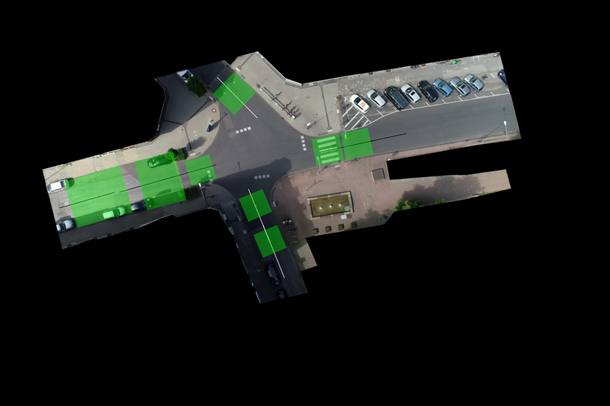
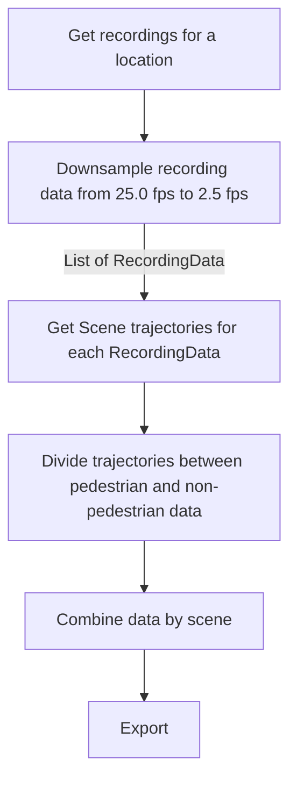

# Extracting by scene configuration

We define a scene as a rectangular area on the road where interesting pedestrian crossing behavior can be found. A scene configuration has the center of the area in world coordinates, and a wdith and height. Reactangular areas have two sides running parallel to the road's center line.

Overall steps:
1. create some scene configuration (bounding boxes of scene areas)
2. Create splines from trajectories.
3. Keep the trajectories that overlaps with the scene bounding boxes. To do that, we only check overlap of trajectories with the middle half of the bounding boxes.
4. Clip trajectories within 1 meter of the bounding box sides. 

For location 2, here goes the bounding boxes. The data is available [here](../data/scenes/ind.json).

# Steps

