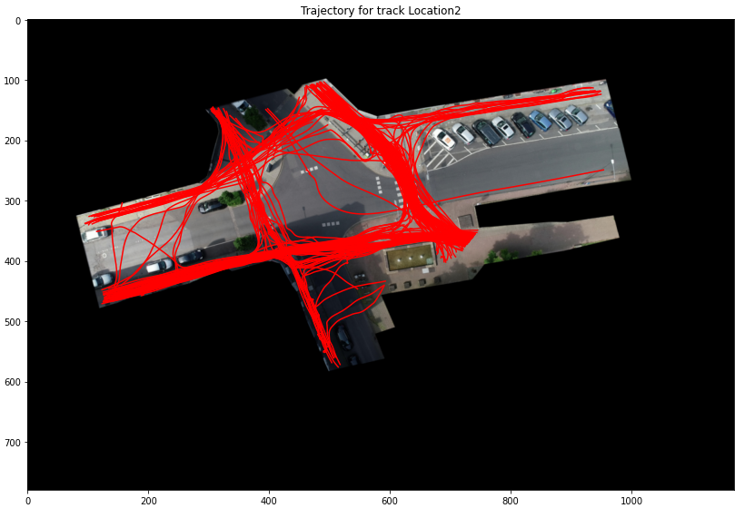

# Trajectory Visualizer: Images for each trajectory

It shows trajectories of tracks.
## Visualising all pedestrian tracks
[Pedestrian viewer Notebook](../src/notebooks/ped-trajectory-viewer.ipynb)

```
dataDir = "........../data/"
loader = Loader(dataDir, 'inD')
recordingData = loader.getRecordingData(recordingId)
visualizer = TrajectoryVisualizer(loader)
for pedId in loader.getSortedPedIds(tracksMetaDf):
    visualizer.showTrack(recordingId, pedId)
```

## Visualising all crossing pedestrian tracks

[Pedestrian viewer Notebook](../src/notebooks/ped-trajectory-viewer.ipynb)

```
dataDir = "........../data/"
loader = Loader(dataDir, 'inD')
recordingData = loader.getRecordingData(recordingId)
visualizer = TrajectoryVisualizer(loader)
for pedId in recordingData.getCrossingPedIds(tracksMetaDf):
    visualizer.showTrack(recordingId, pedId)
```
For location 2, the visualization looks like this:



## Visualizing location crossing data
[Location viewer Notebook](../src/notebooks/location-trajectory-viewer.ipynb)
```
dataDir = "........../data/"
loader = Loader(dataDir, 'inD')
visualizer = TrajectoryVisualizer(loader)
locData = loader.getLocationData(2)
visualizer.showLocationCrossingTracks(locData)
```

# Track Visualizer: Video
first one is old script guaranteed to work. Next one is synced with upstream and sometimes may break.
```
python run_ped_visualization.py --dataset_dir "G:/AV datasets/inD-dataset-v1.0/data/" --dataset "inD" --recording 18 --annotate_track_id True

python run_track_visualization.py --dataset_dir "G:/AV datasets/inD-dataset-v1.0/data/" --dataset "inD" --recording 18 --annotate_track_id True --show_trajectory True --ped_only True 
``

# Location trajec